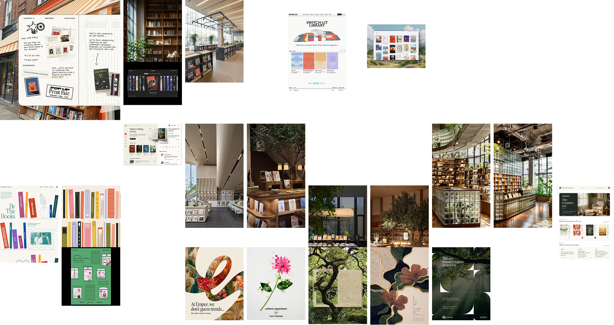

# Reading Library — Design Direction

## The Reading Garden

**The Reading Garden** is a biophilic editorial visual language inspired by contemporary libraries, independent bookstores, natural-light reading spaces, and architecture integrated with landscape.

The Reading Library should feel less like a digital catalogue and more like a personal place for reading, remembering, and returning to ideas.

The experience should evoke the feeling of reading somewhere you would want to stay: beneath a tree, beside water, in a quiet library filled with daylight, in a hammock surrounded by greenery, or in an open café connected to the landscape.

The digital interface should interpret that feeling rather than literally recreate a physical environment.

This document defines the current design direction, not a rigid visual specification.

The Reading Garden is expected to evolve through design iteration. Individual solutions may change as the product develops, as long as the overall experience continues to support the underlying intent.

---

# Mood board

The mood board is a visual reference for the overall atmosphere of The Reading Garden.

It draws from:

- contemporary libraries and bookstores
- architecture integrated with trees and greenery
- indoor/outdoor spaces
- natural-light reading environments
- warm wood, glass, stone and paper
- editorial layouts and printed matter
- botanical imagery and illustration
- landscape and water views
- open-air cafés
- quiet spaces for reading and reflection
- expressive but restrained colour
- books as strong visual objects

The mood board should guide the emotional and visual direction rather than act as a literal specification.

Individual interface decisions do not need to reproduce the references exactly.

Deviation is expected during iteration when it produces a stronger experience.

The goal is to preserve the underlying feeling rather than copy specific compositions.

---

# Design intention

The Reading Library is not primarily a productivity dashboard or book-tracking tool.

It is a personal library containing:

- books I want to read
- books I am currently spending time with
- books I have finished
- ideas that stayed with me
- my interpretations
- my notes and reflections

The design should make the library feel like an accumulating personal space rather than a database of completed books.

Reading should feel like something that leaves traces behind.

The desired overall feeling is:

- calm
- reflective
- personal
- contemporary
- natural
- tactile
- editorial
- spacious
- curated
- immersive

These words describe the desired character rather than a checklist every screen must satisfy.

---

# Core metaphor

The current direction explores a **personal library composed of different reading shelves or spaces**.

Rather than presenting every book as part of one continuous catalogue, the library should communicate where each book currently sits in my relationship with reading.

Three primary reading spaces are currently envisioned:

## In progress

Books I am currently spending time with.

This space should feel active and present without becoming a productivity indicator or progress dashboard.

## To read

Books waiting to be explored.

This should communicate curiosity and anticipation rather than an unfinished task list.

## Read

Books that have become part of my personal library.

Their value is not simply that they have been completed.

Opening them should eventually reveal what I remember, how I interpreted them, and the notes or ideas I chose to keep.

The shelf concept should explore spatial organisation without becoming a literal recreation of wooden bookshelves.

The exact visual interpretation of a "shelf" is intentionally open for experimentation.

---

# Visual language

The Reading Garden combines two broad influences:

**Biophilic design** and **editorial design**.

They should influence each other rather than appear as two separate visual themes.

---

## Biophilic influence

The biophilic direction is inspired by:

- architecture integrated with trees and planting
- indoor/outdoor spaces
- large windows
- filtered daylight
- views towards landscape and water
- warm natural materials
- wood, glass, stone and paper
- botanical forms
- quiet outdoor reading environments
- architecture designed around existing nature

Nature should ideally feel integrated into the environment rather than applied afterwards as decoration.

This does not mean every screen needs visible plants or landscape imagery.

Sometimes the biophilic quality may come through light, space, material, proportion, colour or composition instead.

---

## Editorial influence

The editorial direction is inspired by:

- books
- independent publishing
- magazines
- printed matter
- literary websites
- independent bookstores
- expressive typography
- illustration
- collage
- generous whitespace
- varied scale
- asymmetric but intentional composition
- carefully curated imagery

The editorial influence gives the experience character and prevents it from becoming a generic nature-themed website.

Some areas may behave more like an editorial spread than a conventional application layout when appropriate.

---

# Existing foundation

The current Reading Library already contains qualities worth preserving and developing.

These include:

- warm neutral background
- serif-led literary character
- restrained colour palette
- generous whitespace
- simple interface chrome
- clear book hierarchy
- quiet overall presentation

The redesign does not need to discard these qualities simply because a new visual direction is being introduced.

The current interface can evolve gradually.

The largest transformation may come through:

- composition
- hierarchy
- spatial organisation
- book presentation
- atmosphere
- imagery
- interaction

rather than replacing every existing visual decision.

---

# Books as visual objects

Books should remain among the strongest visual objects in the experience.

The surrounding interface exists partly to create an environment for them.

As real book covers are introduced, they will naturally bring different colours, typography and visual styles into the library.

The surrounding system should allow this variation to feel curated rather than chaotic.

Colour may come substantially from:

- book covers
- selected illustrations
- botanical elements
- environmental imagery
- restrained accent colours

The interface itself can remain quieter so that the books retain their individuality.

This principle should not prevent experimentation with scale, orientation, layering or presentation during later iterations.

---

# Nature as architecture

The Reading Garden should explore nature as part of the space rather than simply as decoration.

The stronger reference is architecture that has been designed around landscape.

Possible expressions might include:

- daylight
- shadow
- framed views
- open space
- organic edges
- foliage entering compositions selectively
- botanical illustration
- architectural framing
- natural material references
- visual depth
- landscape imagery
- views toward water
- transitions between interior and exterior

These are possibilities rather than mandatory UI elements.

The experience should suggest some relationship between library and landscape.

Nature should feel like it belongs to the space.

---

# Typography

Typography should support the literary and editorial character of the library.

A serif typeface can potentially carry:

- book titles
- major headings
- expressive editorial moments
- reflective content

Sans-serif typography can potentially support:

- metadata
- navigation
- statuses
- controls
- small interface information

The exact typography system can evolve during iteration.

Typography should provide character without compromising readability or competing excessively with book covers and personal content.

Avoid introducing decorative typography simply for visual effect.

---

# Colour and material

The current direction favours a warm, natural foundation.

Potential colour families include:

- paper
- warm off-white
- stone
- sand
- muted earth
- foliage green
- deep botanical green
- warm wood tones

These are directional references rather than a fixed palette.

Stronger colour may come from books, imagery and selected editorial elements.

The visual system should avoid becoming uniformly beige or uniformly green.

Material references can influence the interface without necessarily appearing as literal textures.

The goal is to create a sense of warmth and tactility while remaining contemporary.

---

# Composition

The interface should feel composed rather than simply filled with components.

Potential characteristics include:

- breathing room
- deliberate negative space
- varied scale
- editorial alignment
- visual rhythm
- occasional asymmetry
- relationships between books and surrounding space
- intentional moments of density and openness

Not every available area needs to contain interface elements.

The design can sometimes behave more like an editorial spread or architectural composition than a conventional application layout.

However, usability and clarity should remain stronger than visual experimentation for its own sake.

---

# Book reflection experience

Opening a book should eventually feel different from opening a conventional product-detail page.

The book page represents **my relationship with that book**.

Its most important content is not the original book content or a generic summary.

It is:

- what I remember
- what stayed with me
- my interpretation
- my notes
- thoughts I want to return to

The experience may eventually feel closer to opening a personal reading journal associated with that book.

The exact solution will be explored during the dedicated book-reflection redesign rather than predetermined here.

---

# Interaction

Interactions should generally feel quiet and deliberate.

Potential characteristics include:

- gentle transitions
- restrained movement
- subtle depth
- tactile hover states
- book-focused interactions
- movement that reinforces spatial relationships

Motion may help reinforce the experience of:

- browsing
- selecting
- opening
- exploring
- returning

Animation should support the experience rather than exist simply to make the interface feel impressive.

More expressive interactions can still be explored if they strengthen the Reading Garden concept.

Reduced-motion preferences must continue to be respected.

---

# Responsive behaviour

The Reading Garden should retain its identity across different screen sizes.

The underlying ideas of:

- shelves
- books
- reading space
- editorial composition
- atmosphere

should ideally survive on smaller screens.

The mobile experience does not need to reproduce the desktop composition literally.

Responsive simplification and reinterpretation are expected.

The goal is to preserve the character of the experience rather than force the same layout onto every viewport.

---

# Accessibility

Visual experimentation should not compromise usability.

Continue to protect:

- readable typography
- sufficient colour contrast
- visible keyboard focus
- semantic structure
- keyboard navigation
- meaningful accessible names
- reduced-motion preferences
- comfortable touch targets
- zoom behaviour
- narrow-screen behaviour

Accessibility should be considered part of design quality rather than something added after the visual work is finished.

---

# What to avoid

These are warning signs rather than absolute stylistic prohibitions.

The Reading Garden should generally avoid drifting toward:

- a generic SaaS dashboard
- Goodreads
- a Notion-style database
- a conventional ecommerce book grid
- dark academia
- cottagecore
- a fantasy library
- a traditional old-library aesthetic
- a literal wooden bookshelf simulation
- heavy skeuomorphism
- a generic nature website
- decorative foliage everywhere
- scenery that competes with the books
- excessive interface chrome
- excessive animation
- visual clutter

A reference from one of these areas may still be useful if intentionally adapted.

The broader target is:

**contemporary + architectural + botanical + editorial**

rather than adherence to a named aesthetic category.

---

# Iteration principles

The Reading Garden is expected to evolve through implementation.

The purpose of this document is to provide a shared direction, not to remove experimentation.

During iteration:

- explore rather than mechanically reproduce the mood board
- preserve successful existing decisions when appropriate
- change ideas when a stronger solution emerges
- evaluate each visual layer before introducing the next
- avoid redesigning unrelated areas simply for consistency
- prefer intentional evolution over large uncontrolled redesigns
- use real content to judge whether a design works
- treat implementation as another opportunity to discover design problems
- allow small deviations from this document when they improve the overall experience

A design decision should become more fixed only after it has been intentionally reviewed and accepted.

---

# Redesign roadmap

The Reading Garden will be implemented incrementally.

Each stage should be reviewed before the next major visual layer is introduced.

The ticket boundaries provide focus, but they should not prevent small adjustments when those adjustments are necessary to make the current design coherent.

---

## T0015 — Establish Reading Garden visual foundation

Establish the underlying visual language.

Focus primarily on:

- typography
- colour
- spacing
- page proportions
- surfaces
- borders and dividers
- basic interface treatment

The goal is to establish the foundation before substantially changing the library structure.

The shelf system is intentionally deferred.

---

## T0016 — Introduce library shelf structure

Explore reorganising the library around:

- In progress
- To read
- Read

Investigate how a digital shelf can communicate spatial organisation without becoming unnecessarily literal or skeuomorphic.

The exact shelf treatment should emerge through iteration.

---

## T0017 — Refine book presentation

Focus specifically on books as visual objects.

Explore:

- cover presentation
- scale
- spacing
- title and author hierarchy
- status treatment
- hover and focus behaviour
- relationship between books and shelves

Allow the real book covers and real library content to influence the final treatment.

---

## T0018 — Add Reading Garden atmosphere

Explore the stronger biophilic and environmental layer.

Potential areas include:

- greenery
- daylight
- landscape
- architectural framing
- botanical illustration
- natural material cues
- depth
- atmosphere
- imagery

The environment should support the library rather than overpower it.

This ticket should be treated as experimentation rather than an instruction to add every possible environmental element.

---

## T0019 — Redesign book reflection experience

Explore transforming the book-detail experience around personal reading memory.

Prioritise:

- what I remember
- what stayed with me
- interpretation
- notes
- the relationship between reader and book

Avoid defaulting to a conventional product-detail layout.

The exact interaction and composition should emerge through design iteration.

---

## T0020 — Add motion and interaction polish

Explore purposeful movement and interaction refinement.

Motion may reinforce:

- browsing
- shelves
- selecting books
- opening books
- returning to the library

Keep interactions intentional and accessible.

Do not introduce motion simply because the implementation supports it.

---

## T0021 — Final responsive and accessibility pass

Review the complete Reading Garden across:

- desktop
- tablet
- mobile
- keyboard navigation
- zoom
- reduced motion
- contrast
- focus
- long content
- missing content
- edge cases

This stage should primarily refine the completed system.

If testing reveals a larger design problem, it can still be revisited rather than preserved simply because an earlier ticket introduced it.

---

# Design decision log

This section records design decisions that have been intentionally reviewed and accepted.

It should not become a record of every experiment.

Accepted decisions represent the current direction and may still be revisited if later testing, real usage or design iteration reveals a stronger solution.

## Accepted design decisions

### D001 — Design direction

The current visual direction is **The Reading Garden**: a biophilic editorial language influenced by contemporary library architecture, independent bookstores, natural-light reading spaces and architecture integrated with landscape.

### D002 — Reading-state spatial organisation

The current direction explores moving away from one continuous catalogue toward a library spatially organised around reading state.

The initial model is:

- In progress
- To read
- Read

The exact visual implementation remains open to iteration.

### D003 — Personal interpretation over generic summary

Opening a book should prioritise the reader's own memories, interpretation and notes rather than reproducing or generating a generic summary of the book.

### D004 — Nature as environment

Biophilic elements should generally feel integrated into the environment and composition rather than applied as decorative foliage.

The exact amount and visual treatment remain open to experimentation.

### D005 — Incremental redesign

The Reading Garden will be introduced through separate, scoped design iterations rather than implemented as one large redesign.

Each stage should be reviewed before the next major layer is introduced.

---

# Working notes

Use this section during design exploration for observations that may influence later iterations.

Working notes are not accepted design decisions.

They may be changed, removed or contradicted as the design evolves.

When a working idea becomes important enough to guide future implementation, move it into the Design Decision Log after review.